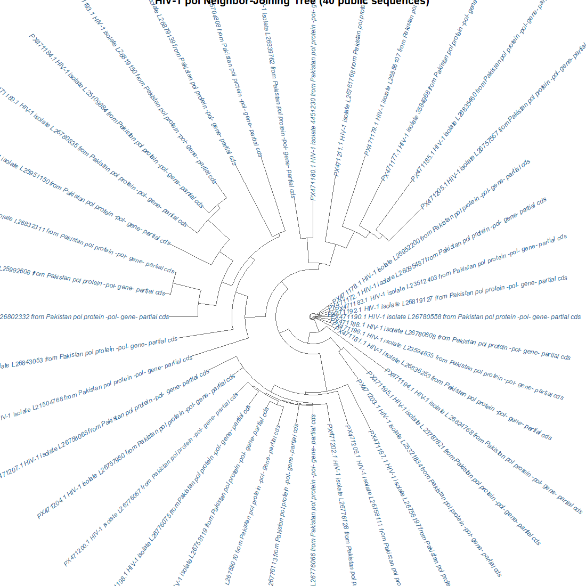
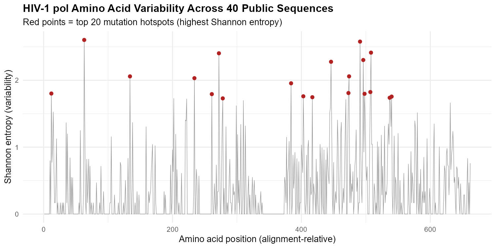

# HIV-1 Drug Resistance Mutation Tracker

## Overview
This project analyzes 40 real, publicly available HIV-1 *pol* gene sequences
(protease + partial reverse transcriptase region) from NCBI GenBank to
identify amino-acid-level mutation hotspots, and checks whether those
hotspots correspond to positions known to be involved in antiretroviral
drug resistance.

## Motivation
HIV's high mutation rate lets it rapidly evolve resistance to antiretroviral
therapy. Certain positions in the protease and reverse transcriptase genes
are well-documented resistance "hotspots." This project asks: **can we
recover biologically meaningful mutation hotspots directly from public
sequence data, using only alignment and information-theory-based variation
analysis — no prior resistance annotation?**

## Data
- Source: NCBI GenBank (`nuccore`), HIV-1 *pol* gene, partial CDS
- 40 sequences, ~1981 bp aligned length
- Reference for coordinate mapping: HXB2 (accession K03455)

## Pipeline
1. `scripts/01_fetch_sequences.R` — retrieve HIV-1 pol sequences from NCBI via `rentrez`
2. `scripts/02_inspect_sequences.R` — sanity-check fetched sequences
3. `scripts/03_align.R` — nucleotide multiple sequence alignment (`DECIPHER`)
4. `scripts/04_analysis.R` — neighbor-joining phylogenetic tree + nucleotide-level entropy scan
5. `scripts/05_protein_hotspots.R` — translate to protein, align, and compute per-residue Shannon entropy
6. `scripts/06_map_to_hxb2.R` — map alignment positions onto standard HXB2 reference numbering
7. `scripts/07_visualize.R` — final hotspot plot and phylogenetic tree figure

## Method
Mutation hotspots were identified using **Shannon entropy** at each aligned
amino acid position across all 40 sequences — a standard information-theory
measure of variability. High entropy = many different amino acids observed
at that position = likely mutation hotspot.

## Results

### Phylogenetic relationships

Most sequences form a tight, closely related cluster (near-zero branch
lengths), with a handful of more divergent isolates (e.g. PX471194, PX471205,
PX471185, PX471187) branching off with visibly longer branches — suggesting
a dominant circulating lineage alongside more distinct variants in this
sample.

### Mutation hotspots

The top 20 highest-entropy amino acid positions (red points) are concentrated
in specific regions rather than spread uniformly — consistent with known
biology, where certain protease/RT regions tolerate variation far more than
structurally constrained "core" residues.

### Comparison to known drug-resistance sites
After mapping our top hotspots onto standard HXB2 reference numbering, one
position (RT residue **138**) corresponds to **E138**, a well-documented
NNRTI accessory resistance site (E138K/A/G, associated with rilpivirine
resistance) — a match between an independently data-derived hotspot and
published clinical literature.

Other top hotspots did not clearly match major resistance codons in this
pass; these may represent natural polymorphism sites, or reflect numbering
offset introduced by CDS-boundary effects in the HXB2 reference extraction
(noted as a limitation below).

## Key Finding
Shannon-entropy-based hotspot detection, applied to 40 public HIV-1 pol
sequences with no prior resistance annotation, independently recovered a
known NNRTI resistance-associated position (E138), supporting entropy
scanning as a lightweight, annotation-free first-pass method for flagging
candidate resistance sites from sequence data alone.

## Limitations
- Small sample size (n=40); results are illustrative, not clinically validated
- HXB2 reference coordinate mapping has an estimated offset of ~20–30
  residues near the pol CDS boundary due to a ribosomal frameshift region
  in the native annotation — absolute codon numbers should be treated as
  approximate, not textbook-exact
- No cross-validation yet against a curated database (e.g. Stanford HIVdb)
  for the full hotspot list — a natural next step

## Tools
R, Bioconductor (`Biostrings`, `DECIPHER`, `pwalign`), `ape`, `rentrez`, `ggplot2`

## Author
Syed Hussain Ahmed